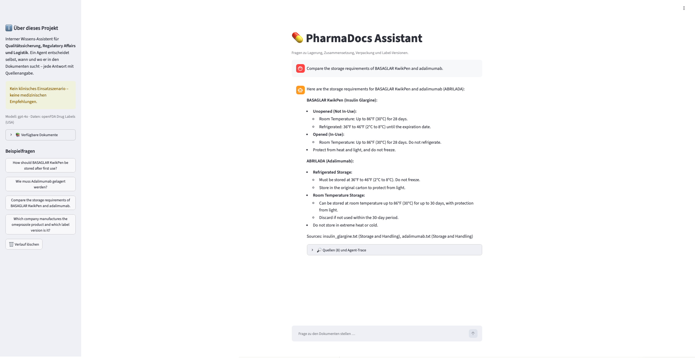
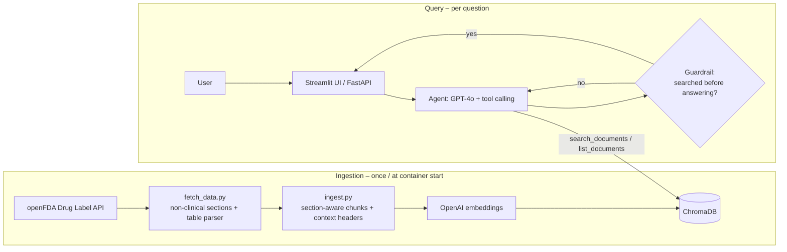

# 💊 PharmaDocs Assistant

[](https://github.com/Nasim-Yazdian/pharmadocs-assistant/actions/workflows/ci.yml)
&nbsp;**[▶ Live demo](https://pharmadocs-assistant.onrender.com)** *(free tier – the first request after inactivity takes ~1 min to wake up)*

An **agentic RAG assistant** that answers questions about pharmaceutical product documents – storage conditions, composition, packaging, label versions – **with source citations**. Designed for non-clinical roles such as Quality Assurance, Regulatory Affairs and Logistics.

> ⚠️ **Not a clinical tool.** No medical recommendations. This is a personal portfolio project; the sample data are public U.S. drug labels from the [openFDA API](https://open.fda.gov/apis/drug/label/). The architecture is domain-independent and would work the same way on internal documents (SOPs, quality guidelines).



## How it works



1. **Ingestion:** `fetch_data.py` downloads the latest prescription-drug labels from openFDA, keeps only non-clinical sections and converts HTML tables into self-contained rows. `ingest.py` splits each document by section, chunks within sections, prefixes every chunk with `[Product | Generic | Section]`, embeds it and stores it in ChromaDB.
2. **Query:** an LLM agent decides **whether, how often and where** to search (e.g. one filtered search per product for comparison questions) and answers only from retrieved passages, citing the source file and section.

## Key features

- **Agent with tool calling** (`search_documents`, `list_documents`) instead of a fixed retrieve-then-generate pipeline (`rag_pipeline.py` is kept as a baseline)
- **Section-aware chunking + contextual chunk headers** – every chunk is understandable on its own
- **Table-aware ingestion** – each table cell becomes `- <row> | <column>: <value>`
- **Guardrails in code, not only in the prompt:** tool-argument validation with self-correction, a verification step (no "not found" without searching), a relevance threshold and a max-step limit
- **Conversation memory** (last 3 turns) for follow-up questions
- **Two interfaces:** Streamlit chat UI (with sources and agent trace) and a FastAPI REST API (`/ask`, `/health`, Swagger at `/docs`)
- **19 unit tests** – including a mocked LLM client to test the agent loop deterministically, without API key or network
- **CI/CD:** GitHub Actions runs the tests on every push; Docker image deployed on Render

## Engineering notes – what I found and how I fixed it

| Observation | Root cause | Fix | Result |
|---|---|---|---|
| One document was only 1 KB although the script reported "8 of 8 saved" | Newest omeprazole label was an OTC product with a different structure | Filter on `product_type: HUMAN PRESCRIPTION DRUG` | Full prescription label (7.5 KB) |
| Tiny duplicate chunks (e.g. `"ctural Formula"`) | Chunking loop produced a leftover chunk consisting only of overlap | Stop when the text end is reached + regression test | 121 → 115 chunks, no duplicates |
| Wrong storage duration for an unopened insulin pen | **Data problem:** flattened HTML table lost the value ↔ column mapping | Table parser producing self-contained rows | Correct (28 days) |
| "30 days after opening" for adalimumab (source says "when traveling") | **Model problem:** gpt-4o-mini forced a parallel structure in comparisons (3/3 runs wrong) | Model configurable via env var; gpt-4o | Correct |
| Agent invented file names for filtered search | Model guessed `basaglar_kwikpen.txt` | Argument validation with a helpful error → self-correction; document list injected into the system prompt | 3 agent rounds → 1 |
| Follow-up "And what about the Tempo Pen?" answered "not found" | No conversation memory; then the model concluded from the document list without searching | Conversation history + verification guardrail | **1/4 → 4/4** correct runs |

Lessons: separate data errors from model errors; measure before fixing; LLMs are non-deterministic, so test repeatedly; enforce critical behaviour in code.

## Tech stack

Python 3.11 · OpenAI (`text-embedding-3-small`, `gpt-4o` / `gpt-4o-mini`, tool calling) · ChromaDB · FastAPI + Pydantic · Streamlit · pytest · Docker · GitHub Actions · Render · openFDA API

## Project structure

```
src/
  config.py        central settings, lazy OpenAI client
  fetch_data.py    openFDA download, section selection, HTML table parser
  ingest.py        section-aware chunking, context headers, embeddings → ChromaDB
  rag_pipeline.py  baseline: fixed retrieve-then-generate pipeline
  agent.py         agent loop, tools, guardrails, conversation memory
  api.py           FastAPI service (/ask, /health)
app.py             Streamlit chat UI
tests/             19 unit tests (no API key / network needed)
start.sh           container entrypoint: ingest if needed, then start Streamlit
```

## Run locally

```bash
git clone https://github.com/Nasim-Yazdian/pharmadocs-assistant.git
cd pharmadocs-assistant
python3.11 -m venv venv && source venv/bin/activate
pip install -r requirements-dev.txt
cp .env.example .env            # add your OPENAI_API_KEY

python -m src.fetch_data        # optional: refresh documents from openFDA
python -m src.ingest            # build the vector database

streamlit run app.py            # UI  → http://localhost:8501
uvicorn src.api:app --reload    # API → http://127.0.0.1:8000/docs
python -m pytest -v             # tests
```

**Docker:**

```bash
docker build -t pharmadocs .
docker run --rm -p 8501:8501 --env-file .env pharmadocs
```

## Limitations & next steps

- **Evaluation is still manual** (a handful of documented cases). Next: an automated evaluation set with LLM-as-judge or RAGAS metrics.
- Character-based chunking within sections; sentence-aware chunking would avoid cuts mid-word.
- The vector store is rebuilt at every container start (fine for 8 documents); production would use a persistent or managed vector database.
- Sample data are U.S. labels in English; a real deployment would use internal or German/EU documents.
- The public demo is protected only by an OpenAI budget limit; production would need authentication and rate limiting.

## License

MIT